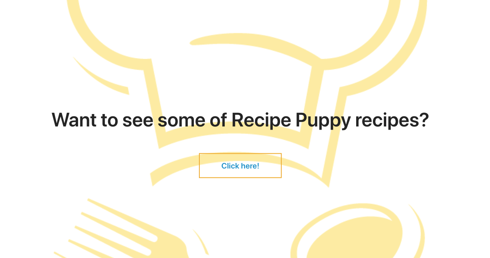
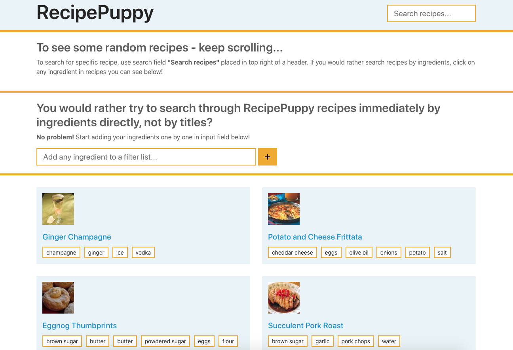

# Credits

This project was generated with [Angular CLI](https://github.com/angular/angular-cli) version 11.2.4.

This project is built on top of <a href="http://www.recipepuppy.com/about/api/" target="_blank">RecipePuppy API.</a>

## Development server

Run `npm start` for a dev server. Navigate to `http://localhost:4200/`. The app will automatically reload if you change any of the source files.

---

# Solution description

## What I have built?

I have built an application for recipes search. The application consists of two screens and three major functionalities.

First screen is a "Welcome screen" which only serves as introduction to a main screen with major functionalities "RecipePuppy" `localhost:{port}/recipes`.

At `localhost:{port}/recipes` user can perform the following actions:
1. search for recipes **by keyword**
2. click on *ingredient's tag* and therefore combine search for recipes with keyword and ingredient
3. add ingredients to a filter list one by one (which is also combined with keyword search)

In order to see more than initially loaded 10 recipes, user can just scroll down to the bottom of the page, and at that moment next 10 recipes will be loaded, etc.

When leaving a website and getting back to it at later point, user can expect the same state (latet keyword, ingredients, and scroll position) of website as it was before he/she left.

## Which technologies I have used and how it is tied together?

I have built an Angular application on top of RecipePuppy API.

Project is generated by use of Angular CLI with chosen setup of Typescript and Sass, so the project structure is defined by it.

**Top level decisions**

1. There are two screens: "Home" and "Recipes", which are placed inside `recipe-puppy/src/app/components`. Application core parts are at `recipe-puppy/src/app/core` (interfaces and services).
2. To retrieve recipe data, api service (`recipe-puppy/src/app/core/services/api.service.ts`) is defined, and for saving data for later (re)usage, local storage service (`recipe-puppy/src/app/core/services/local-storage.service.ts`).
3. For incoming API data, two interfaces have been created, RecipeModel and RecipeModelApi (`recipe-puppy/src/app/core/interfaces`).
4. In terms of styleing, variables for app's font size and colors are defined inside `recipe-puppy/src/styles.scss`. Reason behind defining those variables is to easier maintain and change application wide styles when needed. Those variables, together with component specific styles (`recipe-puppy/src/app/components/home/home.component.scss`, `recipe-puppy/src/app/components/recipes/recipes.component.scss`) are used for styleing each screen.
5. In order to initiate communication / get data from RecipePuppy API to localhost, proxy (`recipe-puppy/proxy.conf.json`) had to be configured, otherwise API responded with CORS error.
6. In order to achieve infinite scrolling instead of pagination, <a href="https://www.npmjs.com/package/ngx-infinite-scroll" target="_blank">ngx-infinite-scroll</a> library has been used. When user reaches the end of current page (current loaded recipes data, which in this case is 10 recipes), app detects end of page, increases page number for 1, and sends new API request to retrieve next portion of recipes data, etc until all possible data for given parameters (keyword and ingredients - if any) is listed.
7. To enable users to come back to a same website state as in his/hers previous visit *(latest scroll position, searched keyword, ingredients)*, local storage service has been used. By its use, recipes data after any change *(scroll to next page, search for keyword, filtering by ingredients, current scroll position)* in user's view gets saved to browser's local storage. On user's next visit, this data is retrieved, reused and showed in browser.
